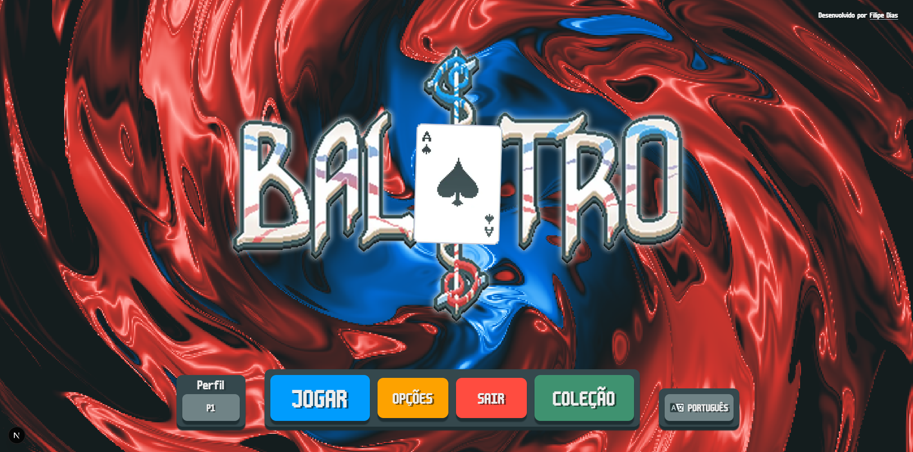
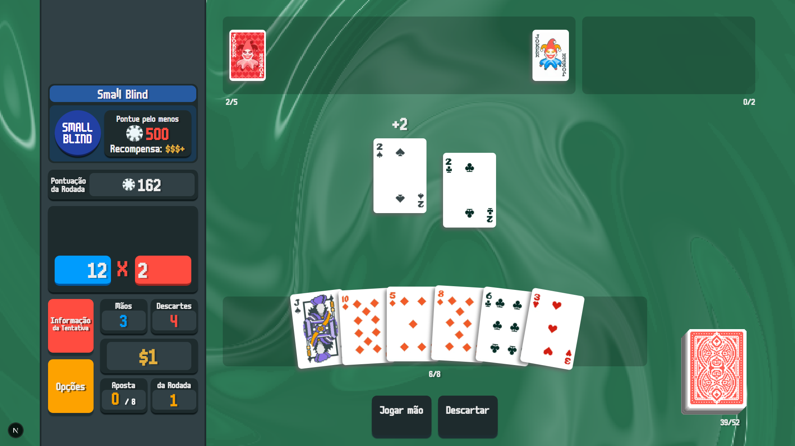

# 🎴 Balatro Game Clone (Web)

Este projeto é uma **recriação do jogo Balatro** para a web, feito como desafio pessoal e homenagem ao jogo original.

---

## 🎮 Sobre o jogo

Balatro é um jogo viciante e criativo que mistura elementos e regras do pôquer com mecânicas únicas e surpreendentes. Depois de vê-lo indicado no The Game Awards, resolvi comprar e me apaixonei pela proposta. Por gostar tanto, decidi me desafiar e recriá-lo usando tecnologias web.

⚠️ **Este projeto é uma cópia didática, sem fins lucrativos. Não tem intenção de substituir ou competir com a obra original. Todos os créditos ao jogo original estão na seção “Opções” > “Créditos” dentro do menu.**

---

## 💡 Como funciona o jogo?

- Você faz jogadas de até **5 cartas**.
- As cartas têm valores equivalentes ao pôquer tradicional (J, Q, K valem 10; Ás valem 11).
- Existem **9 tipos de mãos** possíveis, exibidas na opção “Informação da Tentativa”.
- A **maior mão** formada na jogada prevalece.
- Você precisa alcançar uma pontuação mínima em cada fase (**blind**):
  - *Small Blind*, *Big Blind* e *Boss Blind* (o último possui regras extras, como divisão de pontos).
- Há **4 tentativas de jogada** por blind e **4 descartes disponíveis**.
- Ao vencer um blind, você ganha **dinheiro**.
- O dinheiro é usado para comprar **Curingas (Jokers)**, que aplicam bônus nas jogadas.
- Cada Curinga tem efeitos distintos (ex: bônus por naipe).

---

## 🛠️ Tecnologias Utilizadas

- [Next.js](https://nextjs.org/) – Estrutura do projeto (não essencial, poderia ser feito com React puro).
- [React](https://reactjs.org/)
- [Tailwind CSS](https://tailwindcss.com/) – Estilização
- [Framer Motion](https://www.framer.com/motion/) – Animações
- [Three.js](https://threejs.org/) – Renderização de planos de fundo em 3D
- Assets e referências baseadas no jogo original.

---

## 🧠 Objetivo do Projeto

Este projeto foi criado para fins **educacionais**, como forma de estudo e apreciação pelo jogo original. Algumas mecânicas e visuais foram adaptados para o ambiente web ou propositalmente modificados.

---

## 📜 Créditos

Todos os créditos da obra original estão disponíveis no menu do jogo, na opção:  
**“Opções” → “Créditos”**

Este projeto **não tem relação oficial com os criadores do jogo Balatro**.

- [Site oficial Balatro](https://www.playbalatro.com/)
